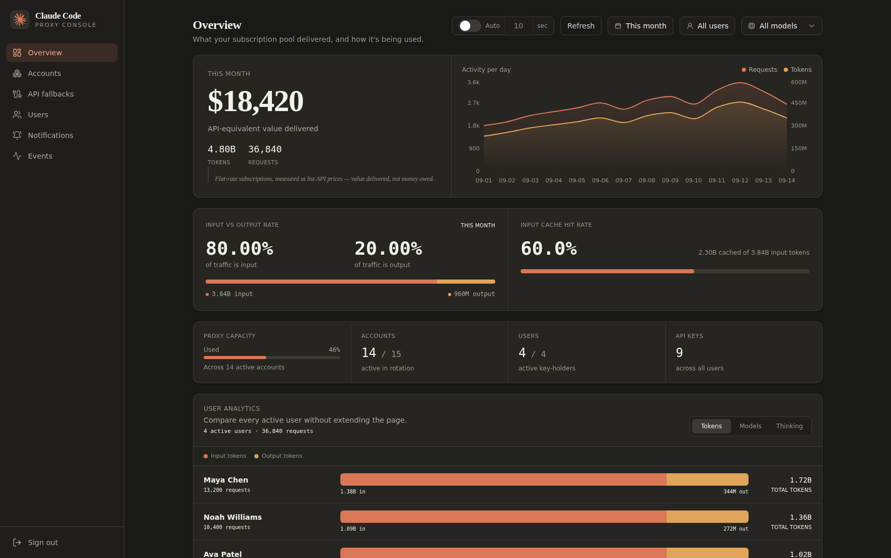
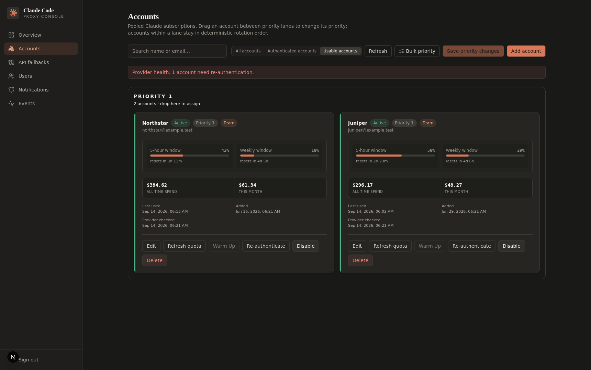
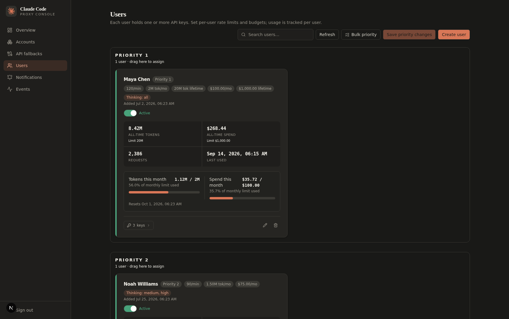
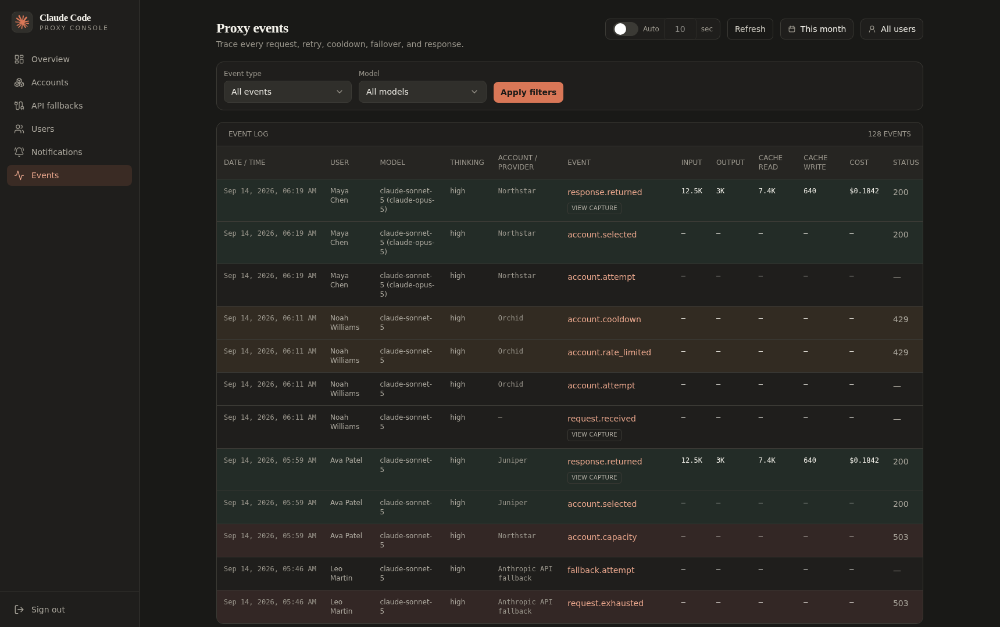
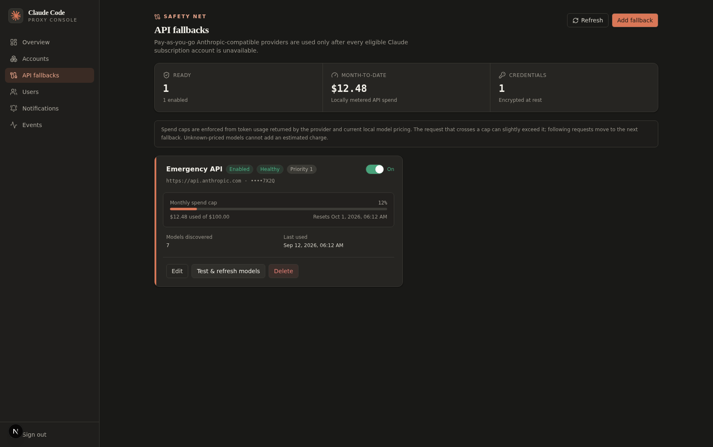
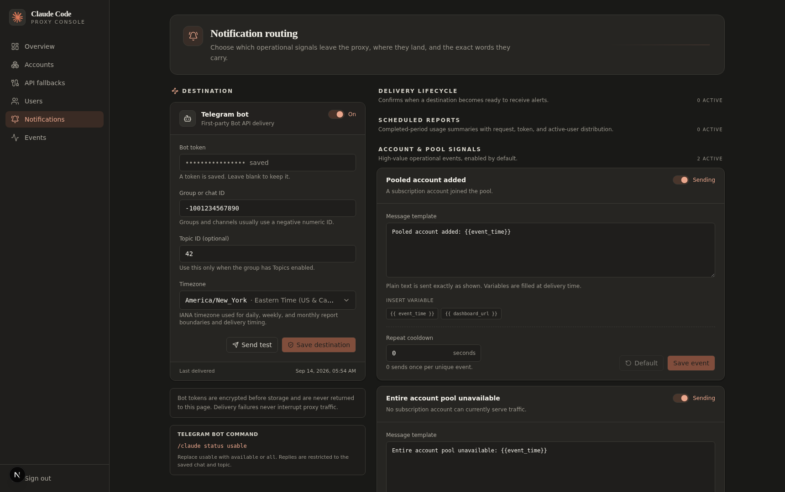

# Claude Code Proxy

Claude Code Proxy is a self-hosted Anthropic-compatible gateway for a pool of
authorized Claude subscription accounts. One endpoint gives a team quota-aware
routing, concurrency control, transparent failover, per-user policies, usage
accounting, request archives, Telegram notifications, and an operations
dashboard.

Looking for an OpenAI-compatible Codex proxy instead? See the companion
[Codex Proxy](https://github.com/devasheeshG/codex-proxy).



The screenshots in this README use internally consistent synthetic data. The
overview contains 4.80B tokens (3.84B input + 960M output) across 36,840
requests, so its 80%/20% split is exact; 2.304B cached input tokens produce the
displayed 60% cache hit rate. Five-hour resets are always less than five hours
away and weekly resets are less than seven days away. All names and
`example.test` addresses are fictional; no production credential, prompt, or
database record is used.

> This is an independent project, not an Anthropic product. Add only accounts
> you control and are permitted to use this way, and review the terms that
> apply to your organization and subscription.

## Quick start

The supported installation path is agent-assisted: copy the complete prompt in
[INSTALLATION_AGENTS.md](INSTALLATION_AGENTS.md) into your coding or infrastructure
agent. It will ask where to install, whether to use a reverse proxy, and whether
to use an existing Postgres instance before it builds, configures credentials,
creates the first user, installs the client helper, and verifies the deployment.
No manual installation steps are required.

## Project status

This project was built quickly and entirely through AI-assisted development—
plainly, it was vibe-coded. I have not personally reviewed a single line of code
on `main`, so `main` should be treated as working but not human-audited software.
Review it for your own environment and risk model before putting sensitive
accounts or production traffic behind it.

That caveat is about code review, not a lack of real-world use. We have used the
proxy internally for roughly four months. During the last three months it has
handled more than 20 billion tokens and about 70,000 requests for us, and it has
been stable without known operational problems. Our experience is not a
substitute for an independent security review, but this is running software—not
an untested demo.

I intend to review the code as time permits. The `human` branch will contain only
code I have personally reviewed, so it will naturally lag behind `main`: humans
are the bottleneck now (pun intended).

## What it provides

### Reliable pooled routing

- Priority-ordered Claude subscription accounts and independent user priorities.
- PostgreSQL advisory-lock concurrency lanes per account, reserving capacity for
  higher-priority users during bursts. Accounts are not pinned to users.
- Provider five-hour and weekly windows, reset times, configurable thresholds,
  cooldowns, degraded/reauthentication state, and deterministic tie-breaking.
- OAuth refresh with serialized refresh-token rotation and reauthentication
  detection.
- Capacity, overload, 401, 404, 429, quota, and connection failures are handled
  before response bytes reach the client; traffic advances to another account or
  fallback.
- Optional demand-triggered and manual warm-up of cold accounts.
- Claude prompt-cache controls for five-minute (default) or one-hour TTL.

### User and key controls

- Multiple users and multiple labelled API keys per user. Key labels are required
  and plaintext keys are shown only once.
- User priorities and bulk priority assignment, independent of account priority.
- Per-user fallback opt-in (off by default), model allowlists, exact model
  rewrites, thinking levels, request modes, and access policies.
- Per-user monthly/lifetime token and spend budgets, plus per-key request/token
  limits and revocation.
- Hashed API keys and Fernet-encrypted OAuth/fallback credentials.

### Team access

- Create, disable, delete, and manage database-backed dashboard members from the
  **Team** page. Each member can be assigned an explicit checked list of exact
  permission strings; there are no required display names or role presets.
- Permissions are split across analytics, archived event bodies, accounts, proxy
  users, API keys, fallbacks, notifications, and team members. Mutating areas
  distinguish read, write, and delete access.
- Authorization is enforced by the API as well as navigation visibility. Unknown
  administrative routes fail closed for non-owner members.
- The environment-configured root login remains the break-glass owner. The
  dashboard deliberately does not store UI audit history or expose session
  revocation controls.

### Deterministic model catalog

Model discovery is local and deterministic, so opening Claude Code does not wait
for every account or fallback provider. The current catalog covers the supported
Sonnet, Haiku, Opus, and Fable families:

| Model | Family |
| --- | --- |
| `claude-fable-5` | Fable |
| `claude-fable-5-1` | Fable |
| `claude-haiku-4-5-20251001` | Haiku |
| `claude-opus-4-6` | Opus |
| `claude-opus-4-8` | Opus |
| `claude-opus-5` | Opus |
| `claude-sonnet-5` | Sonnet |

Exact model rewrites are rendered in events as `target (requested)`.

Supported routes:

| Route | Purpose |
| --- | --- |
| `POST /api/v1/messages` | Anthropic Messages API, streaming and non-streaming |
| `POST /api/v1/messages/count_tokens` | Anthropic token counting |
| `GET /api/v1/models` | Filtered local model catalog |
| `GET /api/v1/me/usage` | Consistent pooled five-hour/weekly usage and reset data |
| `GET /api/health` | Liveness/readiness probe |

Anthropic-compatible API fallbacks are tried only after no eligible subscription
account can serve a request. They have independent priorities, health,
cooldowns, monthly spend caps, encrypted write-only credentials, and per-user
opt-in. Fallback is disabled for every user by default.

## Dashboard tour

### Overview


The overview combines pool health, request volume, token and cost totals, and
reusable controls for automatic refresh, manual refresh, local-calendar date
ranges, user selection, and model selection. Times use the viewer's local
timezone and a consistent 12-hour format. Token values use compact `K`, `M`, or
`B` notation.

### Accounts



Accounts appear in priority lanes and a responsive two-column card grid. Cards
retain quota windows, spend, last use, provider checks, authentication state,
cooldown/degraded state, and edit/refresh/warm-up/reauthenticate/disable/delete
actions. Accounts needing reauthentication are ordered first, followed by the
normal usage order. Green action styling indicates an action that is currently
available.

Bulk actions assign a priority to selected accounts without changing their
other settings.

### Users



Users use the same card language as accounts. Cards show priority, active state,
request mode, thinking levels, allowed models, model rewrites, API-key count,
all-time and current-month tokens/spend, and budgets. Drag-and-drop lanes and
bulk assignment make priority changes explicit; saving is atomic.

### Events and request history



Every request is an operational timeline: receipt, account attempt, selection,
capacity or rate-limit result, cooldown, fallback attempt, response, and
exhaustion. The paginated event table filters by date range, user, model, and
event type, color-codes event families, and includes model, thinking level,
account label, status codes, input/output/cache tokens, estimated cost, and
outcome. Request IDs are intentionally omitted from the normal table.

Successful and failed requests are retained. With archiving enabled, an event
can open the exact request and response body from S3-compatible storage;
authorization and cookie headers are never archived.

### API fallbacks



Fallback entries show label, provider, priority, enabled state, health, spend,
and cap. Operators can enable fallback globally or opt individual users in;
new users remain opted out until explicitly changed. Subscription traffic is
always preferred.

### Notifications



Telegram notifications use an encrypted bot token, destination/chat and
optional topic, timezone-aware schedules, per-event enablement, templates, and
repeat cooldowns. A persistent outbox worker keeps Telegram latency out of the
inference path. Account, pool, user/key guardrail, and daily, weekly, and
monthly report events are supported.

## Request lifecycle

```text
client key
   │
   ├─ authenticate user/key and enforce rate/token/spend budgets
   ├─ apply allowlist and exact model rewrite
   ├─ choose highest-priority eligible user lane
   ├─ choose highest-priority account with a free concurrency lane
   ├─ refresh OAuth if needed and forward the Messages request
   ├─ on capacity/429/quota/connection/credential failure: cooldown + next account
   ├─ if the subscription pool is exhausted: optional user-enabled API fallback
   └─ stream response, record usage/cost, emit events, return consistent usage data
```

The proxy does not return an upstream capacity message after a successful retry
on another account. It returns an error only after the subscription and enabled
fallback paths are genuinely exhausted. Usage headers and `/api/v1/me/usage`
share the same pool-level calculation rather than reporting whichever account
answered last.

The default ceiling is **3 concurrent requests per account**. It is deliberately
configurable and should be calibrated for provider, subscription tier, and
model; see the TODO in `backend/app/utils/account_limiter.py` before changing it.

## First-run setup

1. In **Accounts**, start the Claude OAuth flow and complete authorization in
   the displayed browser page.
2. In **Users**, create a user and a labelled API key. The `usr_...` secret is
   shown once; the setup dialog can generate Claude Code settings.
3. Configure Claude Code with the generated command, or set the equivalent
   environment variables:

   ```json
   {
     "env": {
       "ANTHROPIC_BASE_URL": "http://localhost:8080/api",
       "ANTHROPIC_AUTH_TOKEN": "usr_their_key_here"
     }
   }
   ```

4. Add fallbacks only if needed, and opt each user in explicitly.

The setup helper updates only proxy values in `~/.claude/settings.json`, keeps a
backup, and preserves unrelated Claude Code settings.

### Prompt-cache duration

Claude Code uses a five-minute prompt cache by default. Set
`ENABLE_PROMPT_CACHING_1H=1` in the `env` block for a one-hour cache, or set
`DISABLE_PROMPT_CACHING=1` to disable caching. The included status-line helper
shows the active cache countdown and pooled usage.

## Configuration

Copy `.env.example` for the complete annotated list. The most important values
are:

| Variable | Default | Purpose |
| --- | --- | --- |
| `DOMAIN` | `localhost` | Public host and CORS origin |
| `HTTP_PORT` / `HTTPS_PORT` | `8080` / `8443` | Bundled gateway ports |
| `POSTGRES_*` | — | PostgreSQL connection |
| `FERNET_KEY` | required | Encrypts OAuth and fallback credentials |
| `JWT_SECRET` | required | Signs admin sessions (at least 32 characters) |
| `ADMIN_USERNAME` | `admin` | Dashboard username |
| `ADMIN_PASSWORD` | required | Dashboard password |
| `QUOTA_REFRESH_INTERVAL_SECONDS` | `60` | Provider quota refresh interval |
| `MAX_CONCURRENT_REQUESTS_PER_ACCOUNT` | `3` | Per-account concurrency ceiling |
| `DEFAULT_KEY_RATE_LIMIT_PER_MINUTE` | `0` | Default key limit; zero means unlimited |
| `ARCHIVE_ENABLED` | `false` | Store exact request/response bodies in S3-compatible storage |
| `ARCHIVE_REQUIRED` | `true` | Fail closed when a required archive write fails |
| `WARMUP_ENABLED` | `true` | Enable demand-triggered/manual warm-up |

## Production deployment

Use the repository's blue-green script for live updates. It keeps one shared
Traefik gateway, starts the next Compose slot, waits for health checks, probes
the new API, promotes API before frontend, and drains the old slot only after
both routes identify the new generation.

```bash
scripts/blue-green.sh status
BG_COMPOSE_FILES=docker-compose.yaml:docker-compose.live.yml \
BG_URL=https://claude-proxy.example.com \
make deploy-blue-green
```

For an independent availability log during a rollout:

```bash
scripts/probe-availability.sh https://claude-proxy.example.com/api/health &
probe_pid=$!
make deploy-blue-green
kill "$probe_pid"; wait "$probe_pid" || true
```

Validate rendered Compose labels before changing containers:

```bash
BG_SLOT=blue BG_PRIORITY=1 BG_API_PRIORITY=2 \
docker compose -f docker-compose.yaml -f docker-compose.live.yml config --quiet
```

## Security and data retention

OAuth and fallback secrets are encrypted with Fernet. User keys are stored as
one-way hashes. Archived bodies are optional, compressed, and written to an
S3-compatible bucket; prompt and tool content may contain sensitive data, so
restrict bucket access and configure retention. Authorization and cookie
headers are excluded from captures. Review `SECURITY.md` before exposing the
dashboard publicly.

## Development

```bash
make verify
cd backend && uv sync && uv run pytest
cd frontend && pnpm install && pnpm lint && pnpm build
```

The main directories are `backend/` (FastAPI, SQLAlchemy, Alembic), `frontend/`
(Next.js dashboard), `clients/` (Claude Code helpers), and the Compose/deployment
files at the repository root.

## Contributing and project policy

Issues and pull requests are genuinely welcome. Feel free to open an issue for
anything that could be clearer or better, or send a PR if you want to fix or
improve something yourself.

- Use Issues for reproducible bugs, focused feature requests, and documentation
  problems. Search first, use one issue per concern, reproduce against the latest
  `main`, and include sanitized logs when relevant. There is no support SLA.
- Never disclose credentials, archived prompts, private logs, or database data in
  an issue. Report vulnerabilities through the repository's
  [private vulnerability-reporting flow](https://github.com/devasheeshG/claude-code-proxy/security/advisories/new).
- Small fixes and documentation PRs do not require a prior issue. Discuss large
  features, migrations, protocol changes, and architectural work in an issue
  before implementation.
- PRs branch from `main`, stay focused, include relevant tests and UI screenshots,
  update documentation, and pass backend/frontend CI. A merge into `main` does
  not mean the code received line-by-line human review; use `human` when that
  distinction matters.
- Draft PRs are welcome. There is currently no CLA; contributions are made under
  AGPL-3.0 and participation follows the Code of Conduct.

See [CONTRIBUTING.md](CONTRIBUTING.md), [SECURITY.md](SECURITY.md),
[CODE_OF_CONDUCT.md](CODE_OF_CONDUCT.md), and the
[previous detailed README](README.old.md) for the complete policy and upgrade
context.

## License

[AGPL-3.0](LICENSE). If you run a modified version as a network service, make
the corresponding source available to its users.
